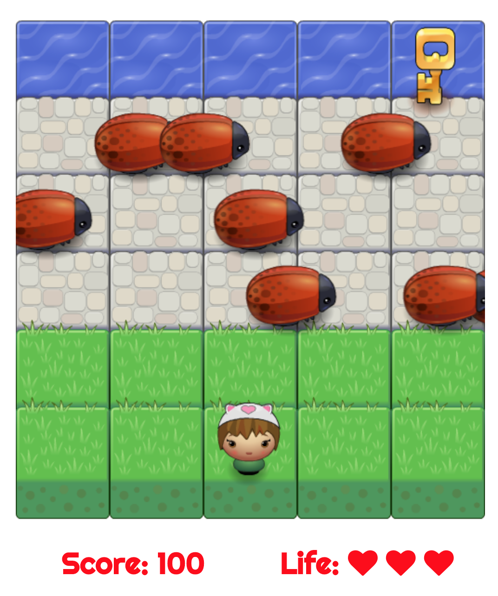

# Classic Arcade Game

## How to play?
Your goal is to collect keys. Use arrows to move player use. You have to avoid enemies. One touch from enemy and your life is gone. You have only three lives, so be careful.

## Goal
Creating classic arcade game for the Front-End Web Developer Nanodegree Program in Google Developer Challenge Scholarship 2017/2018.

## Contributing
First commit is the starter code from Udacity. https://github.com/udacity/frontend-nanodegree-arcade-game

## Website
https://mormar.github.io/Classic-Arcade-Game/

## Dependecies
[FontAwesomeIcons](https://fontawesome.com) 
